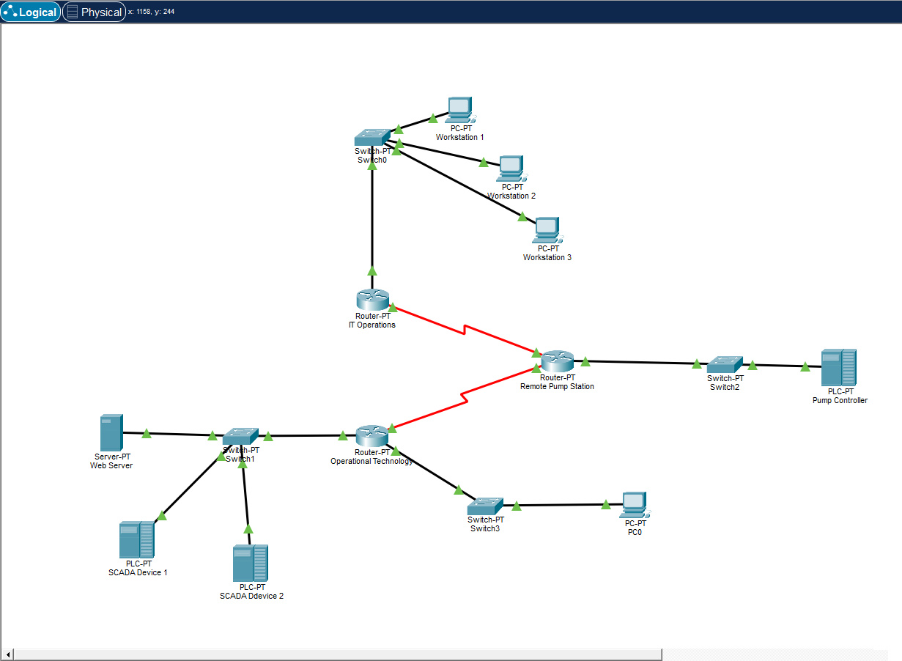
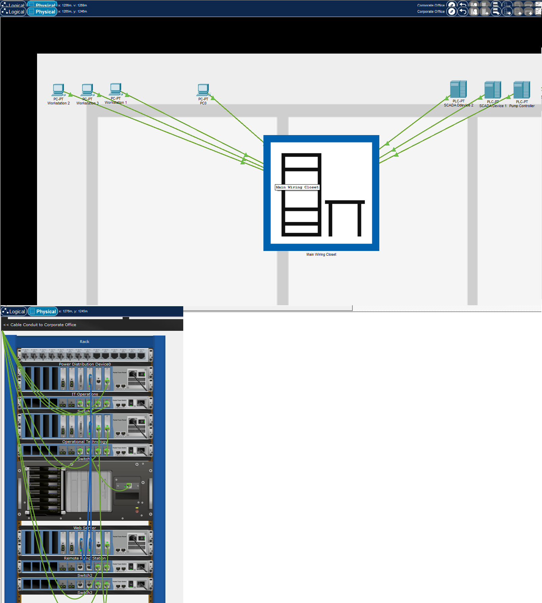
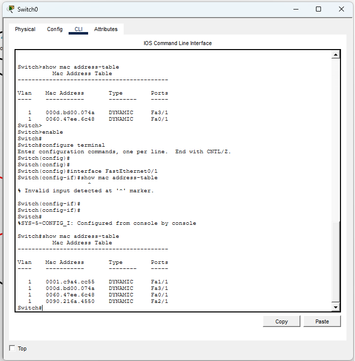
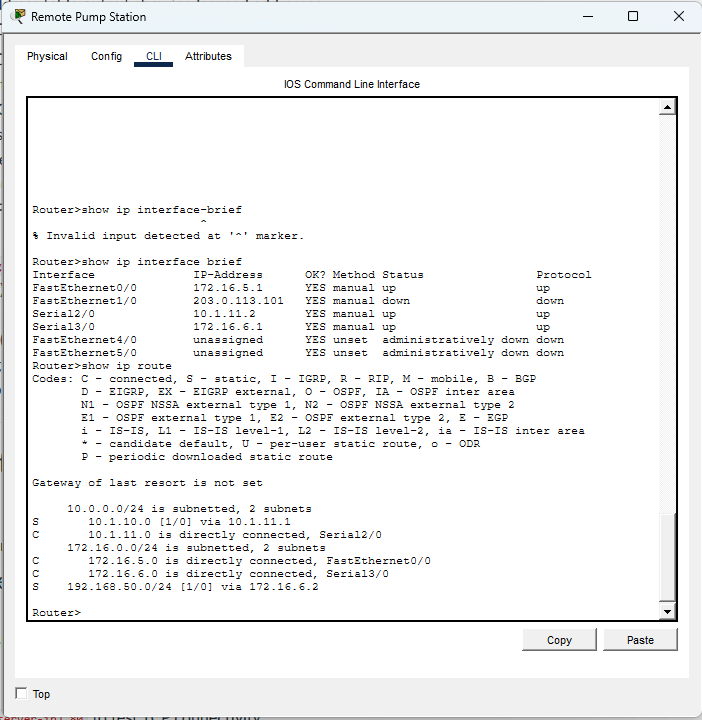
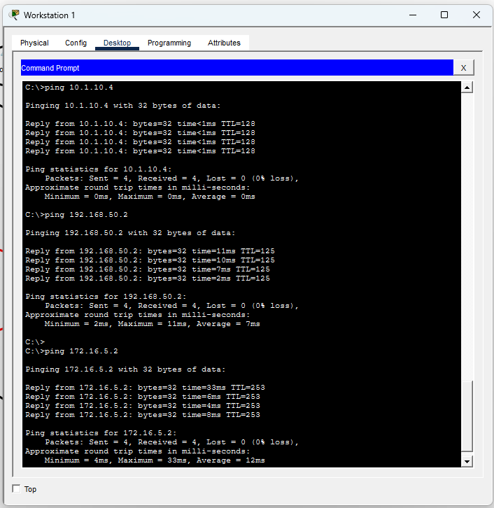
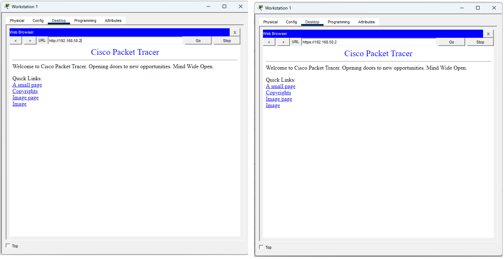
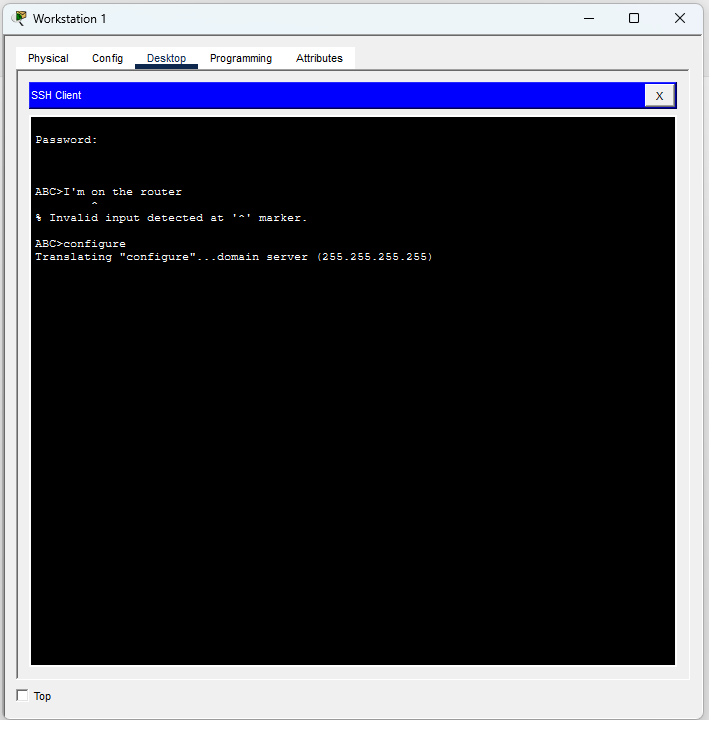
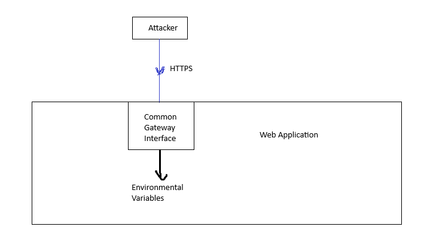

# Lab 04: Enterprise LAN Design and Security Assessment
Arek Kashian  
IT 520  
April 3, 2026

## Part 1 - Network Architecture

The first layer of the OSI model is the physical layer, which in this setup is entirely copper ethernet cabling. This is how information is conveyed between devices on the network as electrical signals. Within the OSI model, this is how logical communication is transformed into hardware-specific transmissions

### MAC Addresses

IT Operations Router 1

- Workstation 1: 0060.47EE.6C48
- Workstation 2: 0001.C9A4.CC55
- Workstation 3: 0090.216A.4550

Operational Technology Router 2

- Web Server: 000D.BD91.E987
- SCADA Device 1: 0040.0B3B.3A0A
- SCADA Device 2: 0004.9A55.259C

Remote Pump Station Router 3

- Pump Controller: 0090.2116.EE5A
- Attacker Node: 0001.63BD.BEB4

## Part 1.2 - MAC Addresses and Switching

This is the second layer of the OSI model, the data link layer. This layer provides procedures to transfer data between nodes on a network. Examples include ethernet and wi-fi, along with address resolution protocol and MAC addresses. A network switch is a device operating primarily at this layer. In this case, the switch sorts packets according to what physical device they are supposed to go to, identified by the MAC, and which is linked to an IP address automatically by the switch as traffic crosses through it

## Part 1.3 Network Layer Configuration (Routing)

Routing represents level 3 of the OSI model, the network layer, as it represents in a logical way the connections between devices on different networks, allowing for data to flow between them with actual directions as opposed to a mass broadcast, and IP addresses also enable this function. Internet Protocol or IP is the most commonly used such protocol but there have been others proposed and in theory. IPv6 is an updated version of IP to address the problem of running out of addresses, but has only slowly come into actual use

## Part 1.4 Connectivity Verification

# Part 2 - Protocol Security Analysis

The TCP handshake system allows for better security than UDP because it requires both parties in the communication to identify themselves and form a steady connection, without which the packets do not make it to the application layer. This enables authentication and authorization to be implemented, which cannot be done with UDP. UDP is vulnerable to spoofing, as forged packets cannot be distinguished from real ones

TCP and UDP operate at level 4 of OSI, the transport layer, because they are encapsulations of data to transport them across the logical network formed by the router and IP address system.

## Part 2.2

TLS and HTTPS prevent man in the middle attacks by encrypting the data sent over SSH with a key exchange between the browser and the server beforehand. This encryption is operating at the presentation or the session layer according to different sources, the session layer seems more accurate to me

SSH replaced telnet because requiring encryption keys adds an additional layer of security and makes it harder to brute force passwords, prevents spoofing and man in the middle attacks as telnet is transmitted in cleartext

# Part 3 - Shellshock Vulnerability

Shellshock is a security vulnerability in web applications created by flaws in widely distributed versions of the Bash shell commonly used on Unix-type systems. It allowed for anyone to send a specially constructed HTTP or HTTPS request to obtain full code execution abilities within the bash shell running the web application. This bypasses all other application level security like HTTPS. Some potential exploitation scenarios are botnet and worm propagation, IoT device security bypassing, and classified data exfiltration. The fix for this issue is to patch the bash shell, but this is often difficult to implement for many devices.

# Part 4 - Incident Response

This could be an attack path diagram for the shellshock attack. The attacker sends a specially crafted HTTPS request in which the headers insert a full function into the environmental variables of the web application through the Bash shell, and thereby take control over the application.

|Possible root cause|Why not detected|Why not prevented|
|-------------------|----------------|-----------------|
|Lack of software security updates|Lack of regular checks of vulnerability reports|Lack of procedure for regular software updates|
|Bash shell reading functions into environment|Lack of security review of codebase|Very old software means change will break many uses|
|Web application uses bash and common gateway interface|Lack of security review of codebase|Cheap and easily implemented technologies for web app development|

## Remediation Plan

Containment of this issue is difficult and would likely require shutting the service down entirely. If a backup is available that should be brought into service. If the service is important, it may not be worth shutting it down and simply hoping for the best. In the medium term, rolling out a patched version of the Bash software is the only thing that can be done, and in the longer term rewriting the web application to use more secure technologies than Bash and common gateway interface. Also, in the longer term contingency plans should be implemented, and backups for critical services created.

# Part 5 - OSI Model Mapping Summary

|Section|OSI Layer|
|-------|---------|
|Part 1.1|Layer 1 Physical|
|Part 1.2|Layer 2 Data Link|
|Part 1.3|Layer 3 Network|
|Part 1.4|N/A|
|Part 2.1|Layer 4 Transport|
|Part 2.2|Layer 7 Application|

# Conclusion

This assignment showed to me that network design and architecture cannot really be separated from security and they are largely the same thing. There are exceptions like shellshock that target vulnerabilities in particular versions of system software but the basic architecture will greatly expand or reduce the attack surface. Configuring a network at this level of granularity is not something I had experience with before and has been very interesting.
